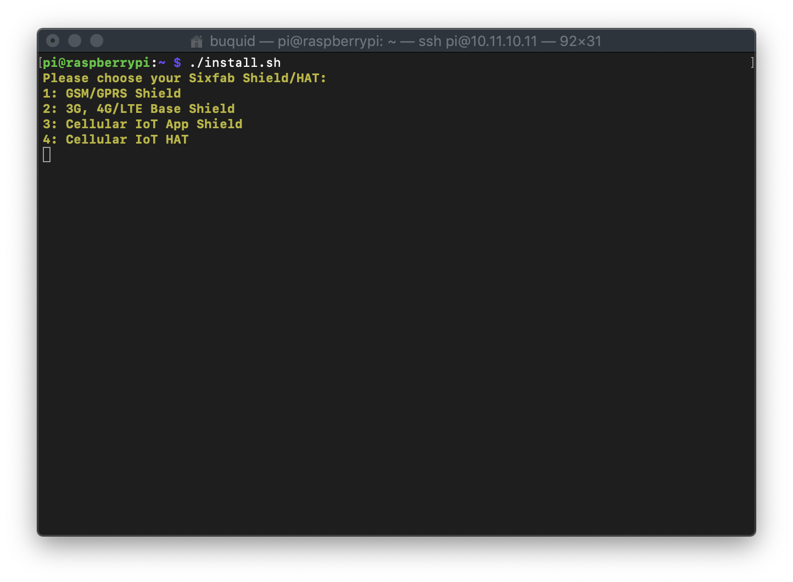
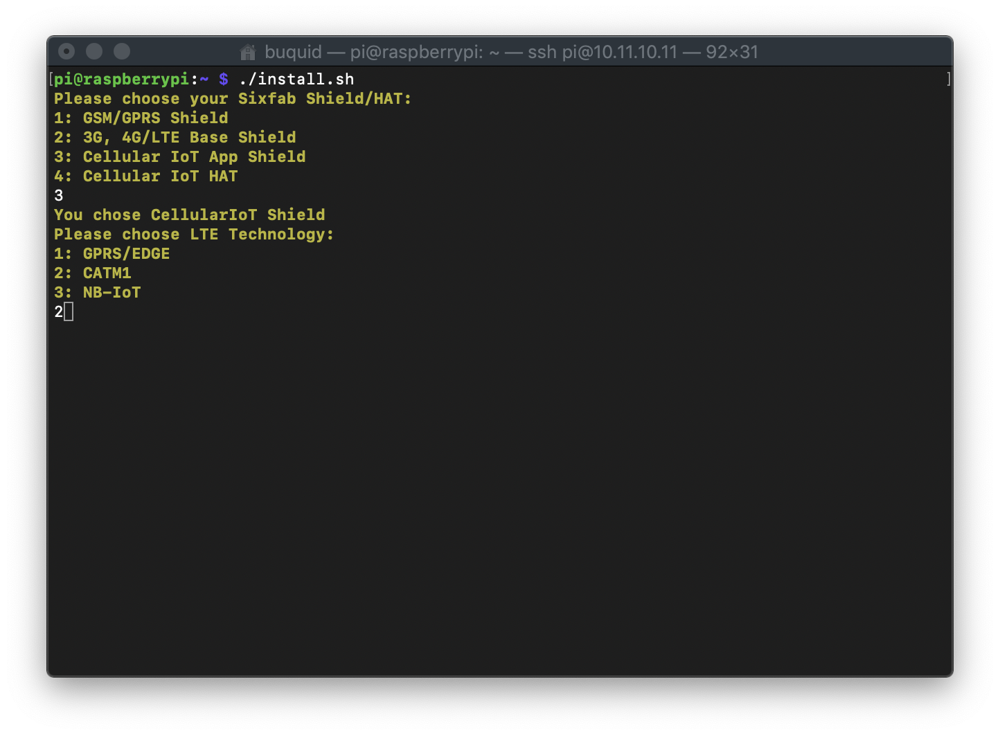

# Secure IoT Accelerator Program

The Secure IoT Accelerator program is intended to enable Canadian Internet of Things (IoT) ventures by providing them with global market reach capability with a Secure by Design technology.

For more information about the accelerator program, visit: https://www.l-spark.com/press-release/l-spark-telus-blackberry-and-solace-launch-accelerator-for-emerging-canadian-iot-ventures/

Youtube: https://www.youtube.com/watch?v=ZL2ADLHl-XQ&feature=youtu.be

IoT technical information session webinar: https://zoom.us/recording/share/PWJ3D-qfgsRB5TrQGfzrThJIY4mG5bUspvZ49OwiZNywIumekTziMw

# Let's get started

This getting started tutorial will help accelerator program participants with setting up the cellular shield, raspberry pi and installing applications required to validate devkit functions and features.

Participants will receive the following hardware when they join the accelerator program:

1. TELUS Cat-M1 cellular shield
2. Raspberry Pi and accessories
3. TELUS Removable eSIM

This version of the shield also has an embedded SIM which can be used as the default by sliding the **SIM <> eSIM** switch to **eSIM**


## Setting up the Hardware

1. Connect the LTE Cat-M1 antenna and insert removable eSIM to cellular shield as shown below indicated by red boxes. 

      Additionally, you can also connect GPS antenna if you intended to develop application that would use GPS location.

      

2. Connect the cellular shield and raspberry pi.

      
      

3. Connect the USB cable as shown below.

      
            

4. Connect the micro USB cable as power source (included in the package) and ethernet cable for internet connection, optionally, you can also use Wifi for internet connection.

   `This tutorial assumes that Raspian OS has been installed and configured ahead of time, if not, the participant shall install and configure Raspian OS before continuing to the next steps.`
   
5. Power on Raspberry Pi, the shield will also automatically power on as well with a blue indicator light flashing. 
   
    
      
6. Toggle the **SIM <> eSIM** switch on the cellular shield shown below to chose which sim to read from. **SIM** reads the removeable SIM while **eSIM** reads the embedded SIM. 

    
   
7. If you are on Raspian OS desktop, open Terminal to verify USB ports are mounted.

   Command to verify USB ports are mounted: `ls -l /dev/tty*`
   
    
   
   You will also notice that `/dev/ttyS0` (serial) is available. If you don't see `/dev/ttyS0` when you `ls -l /dev/tty*` then you need to enable Serial via [raspi-config](https://www.raspberrypi.org/documentation/configuration/raspi-config.md).

8. Alternatively, you can also onnect (login) to Raspberry Pi using SSH via Terminal (mac), Tera Term or Putty (windows). If SSH is not available, you can enable SSH via [raspi-config](https://www.raspberrypi.org/documentation/configuration/raspi-config.md).

## Connecting the Modem

Since we are using Sixfab cellular shield, we are going to head to [Sixfab Tutorial](https://sixfab.com/tutorials/) page and follow the instruction on how to install [PPP dialer](https://sixfab.com/ppp-installer-for-sixfab-shield/) with some modifications and configurations specific to TELUS Cat-M1 network.

PPP installer for Sixfab Shield: https://sixfab.com/ppp-installer-for-sixfab-shield/

You may refer to the following video or work through the steps below:
[](https://youtu.be/HkHLNoD_Zog)

1. In Step 3 of the Sixfab tutorial, select **Cellular IoT App Shield** and in step 4, select **Cat-M1** 

 
      
 

2. Set APN to **pp.telus.com**

3. Device communication port can be **ttyS0** or **ttyUSB3**

 
      
       
       
4. Edit **/etc/chatscripts/chat-connect**

      Command: `sudo nano /etc/chatscripts/chat-connect`
      
      Replace the content of **/etc/chatscripts/chat-connect** with this:
      
      ```
      
      # /etc/chatscripts/chat-connect
      ABORT "BUSY"
      ABORT "NO CARRIER"
      ABORT "NO DIALTONE"
      ABORT "ERROR"
      ABORT "NO ANSWER"
      TIMEOUT 30
      "" AT
      OK ATE0
      OK ATI;+QGMR;+CIMI;+QCCID;+CSUB;+CSQ;+COPS?;+CGREG?;&D2
      OK AT+CGDCONT=1,"IP","\T","0.0.0.0",0,0
      OK AT+QCFG="band",F,800,80,1
      OK AT+QCFG="nwscanseq",00,1
      OK AT+QCFG="nwscanmode",0,1
      OK AT+QCFG="iotopmode",2,1
      OK AT+CPSMS=0
      OK ATD*99#
      CONNECT
      
      ```

5. If you want change the port (**ttyS0** or **ttyUSB3**) that PPP dialer use, you can edit **/etc/ppp/peers/provider**

      

6. To connect, the command to use is `sudo pon` and you will see similar to below once modem successfully connected to TELUS Cat-M1 network.

      
      
### (Optional) Connect using QMI, alternative to PPP dialer

If you want to use QMI, head back to [Sixfab Tutorial](https://sixfab.com/tutorials/) page and follow the instruction on how to install QMI [here](https://sixfab.com/qmi-interface-with-3g-4g-lte-base-shield-v2/), though its for 3G/4G it seems to be working for Cat-M1.

https://sixfab.com/qmi-interface-with-3g-4g-lte-base-shield-v2/

After installation, the command to connect is: `sudo ./quectel-CM -s pp.telus.com`, below is the output of the command. Notice at the bottom there is a **Too few arguments** messages. I am not sure what is causing this error (have to check with Sixfab) but regardless the modem is connected.


## Hardware Information

Sixfab cellular shield information can be found here: https://sixfab.com/product/raspberry-pi-cellular-iot-application-hat/

**Layout**


**Electrical Pinout**


**Pin Descriptions**

| Pin Number    | BCM Pin       | Pin Name  | Description|
| ------------- |:-------------:| :-----:|-------------|
| 2 | 5V | 5V PWR |This pin is connected to the 5V power net|
| 3 | GPIO 2 |   SDA |I2C Serial Data|
| 4 | 5V | 5V PWR |This pin is connected to the 5V power net|
| 5 | GPIO 3 |  SCL | I2C Serial Data |
| 7 | GPIO 4 |  1-WIRE | Data line for 1-Wire sensors.|
| 8 | UART RX |  BG96 TX | This pin functions as the serial data input to the module for UART communication.|
| 10 | UART TX |  BG96 RX | This pin functions as the serial data output to the module for UART communication. |
| 11 | GPIO 17 |  RELAY | Relay control pin. This relay is active high.|
| 12 | GPIO 18 |  IN-2 | When the voltage in the range 3.3-1.2V is applied from the IN-2 input, this pin goes to a LOW state. Default state is HIGH. |
| 13 | GPIO 27 |  USER LED | Active HIGH, to switch on the USER LED, pin state must be HIGH. |
| 18 | GPIO 24 |  USER BUTTON | This pin is pulled-up by default. when the button is pressed, the pin is switched to LOW. |
| 19 | GPIO 10 |  IN-1 |When the voltage in the range 3.3-1.2V is applied from the IN-1 input, this pin goes to a LOW state. Default state is HIGH.  |
| 23 | GPIO 11 |  BG96 PWRKEY | The module can be turned on by driving the pin BG96 PWRKEY to a HIGH-level voltage for more than 500 ms then pulling it down. You can apply the same process to power down the module if already powered up.|

| 31 | GPIO 6 |  BG96 APREADY | AP_READY will detect the sleep state of the host (can be configured to HIGH level or LOW level detection). Please refer to AT+QCFG="apready" command for details.|
| 33| GPIO 13 | BG96 RI | When BG96 had URC to report, RI signal will wake up host. Please refer to Chapter 3.14 of the BG96 Datasheet for details about RI behaviour. |
| 37| GPIO 26 |  BG96 POWER ENABLE | BG96 3.8V Power regulator control. Normally pulled-up, when this pin is driven LOW, BG96's power will cut off.|
| 38 | GPIO 20 |  BG96 STATUS | The STATUS pin is used to indicatr the operation status of the BG96 module. It will output High level when the module is powered on. |
| 6,9,14,25,30,34,39 | GND |  GND | These pins are connected to ground |


**Electrical Characteristics of Pins**

*Will be added shortly*


**Schematic and BG96 documents**

You can download the schematic of Raspberry Pi Cellular IoT Application Shield from here: https://github.com/sixfab/Sixfab_RPi_CellularIoT_Library/tree/master/documents

### Hope this helps.
