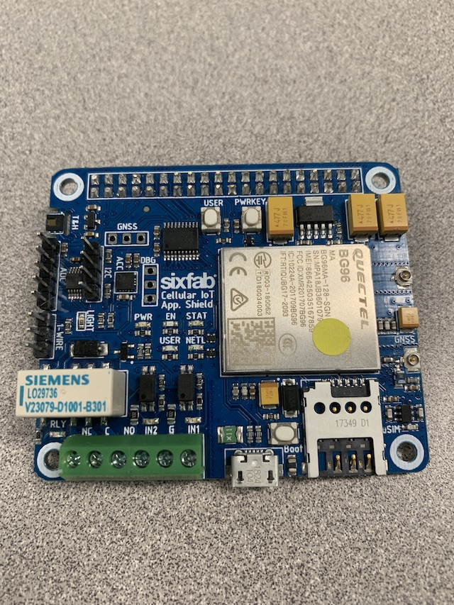

# TELUS Dekit for Secure IoT Accelerator Program

The Secure IoT Accelerator program is intended to enable Canadian Internet of Things (IoT) ventures by providing them with global market reach capability with a Secure by Design technology.

This getting started page will help you with setting up the cellular shield, raspberry pi and installing applications required to validate devkit functions and features.

# Let's get started

## Setting up the hardware

