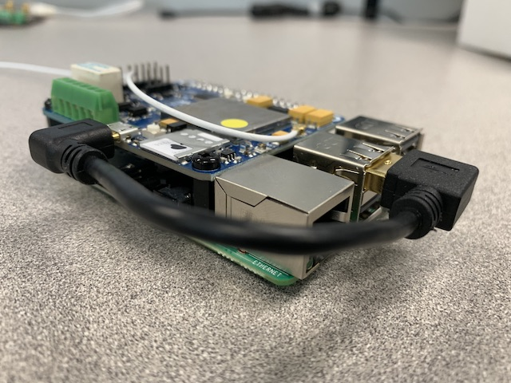

# TELUS Dekit for Secure IoT Accelerator Program

The Secure IoT Accelerator program is intended to enable Canadian Internet of Things (IoT) ventures by providing them with global market reach capability with a Secure by Design technology.

For more information about the accelerator program, visit: https://www.l-spark.com/press-release/l-spark-telus-blackberry-and-solace-launch-accelerator-for-emerging-canadian-iot-ventures/

This getting started tutorial will help accelerator program participants with setting up the cellular shield, raspberry pi and installing applications required to validate devkit functions and features.

# Let's get started

Participants will receive the following hardware when they join the accelerator program:

1. TELUS Cat-M1 cellular shield

      
2. Raspberry Pi and accessories

3. TELUS Removable eSIM

## Setting up the Hardware

1. Connect the LTE Cat-M1 antenna and insert removable eSIM to cellular shield as shown below indicated by red boxes. 

      Additionally, you can also connect GPS antenna if you intended to develop application that would use GPS location.

      

2. Connect the cellular shield and raspberry pi.

      

3. Connect the USB cable as shown below.

      
            

4. Connect the micro USB cable as power source (included in the package) and ethernet cable for internet connection, optionally, you can also use Wifi for internet connection.

   `This tutorial assumes that Raspian OS has been installed and configured ahead of time, if not, the participant shall install and configure Raspian OS before continuing to the next steps.`
   
5. Power on Raspberry Pi. 
      
6. Press **Power button** on the cellular shield shown below in red circle to enable cellular connection and mount USB ports in Raspberry Pi.

    
   
7. If you are on Raspian OS desktop, open Terminal to verify USB ports are mounted.

   Command to verify USB ports are mounted: `ls -l /dev/tty*`
   
    
   
   You will also notice that `/dev/ttyS0` (serial) is available. If you don't see `/dev/ttyS0` when you `ls -l /dev/tty*` then you need to enable Serial via [raspi-config](https://www.raspberrypi.org/documentation/configuration/raspi-config.md).

8. Alternatively, you can also onnect (login) to Raspberry Pi using SSH via Terminal (mac), Tera Term or Putty (windows). If SSH is not available, you can enable SSH via [raspi-config](https://www.raspberrypi.org/documentation/configuration/raspi-config.md).

## Connecting the Modem

Since we are using Sixfab cellular shield, we are going to head to [Sixfab Tutorial](https://sixfab.com/tutorials/) page and follow the instruction on how to install [PPP dialer](https://sixfab.com/ppp-installer-for-sixfab-shield/) with some modifications and configurations specific to TELUS Cat-M1 network.

PPP installer for Sixfab Shield: https://sixfab.com/ppp-installer-for-sixfab-shield/

1. In Step 3, select **Cellular IoT Shield**

      

2. Set APN to **pp.telus.com**

3. Device communication port can be **ttyS0** or **ttyUSB3**

      
      
4. Edit **/etc/chatscripts/chat-connect**

      Command: `sudo nano /etc/chatscripts/chat-connect`
      
      Replace the content of **/etc/chatscripts/chat-connect** with this:
      

5. If you want change the port (**ttyS0** or **ttyUSB3**) that PPP dialer use, you can edit **/etc/ppp/peers/provider**

      

6. To connect, the command to use is `sudo pon` and you will see similar to below once modem successfully connected to TELUS Cat-M1 network.

      
      
### Connect using QMI, alternative to PPP dialer

If you want to use QMI, head back to [Sixfab Tutorial](https://sixfab.com/tutorials/) page and follow the instruction on how to install QMI [here](https://sixfab.com/qmi-interface-with-3g-4g-lte-base-shield-v2/), though its for 3G/4G it seems to be working for Cat-M1.

https://sixfab.com/qmi-interface-with-3g-4g-lte-base-shield-v2/

After installation, the command to connect is: `sudo ./quectel-CM -s pp.telus.com`, below is the output of the command. Notice at the bottom there is a **Too few arguments** messages. I am not sure what is causing this error (have to check with Sixfab) but regardless the modem is connected.

## Hardware Information

Sixfab cellular sheild can be found here: https://sixfab.com/product/raspberry-pi-cellular-iot-application-hat/

**Layout**

**Electrical Pinout**

**Pin Descriptions**

**Electrical Characteristics of Pins**

**Schematic and BG96 documents**

You can download the schematic of Raspberry Pi Cellular IoT Application Shield from here: https://github.com/sixfab/Sixfab_RPi_CellularIoT_Library/tree/master/documents

